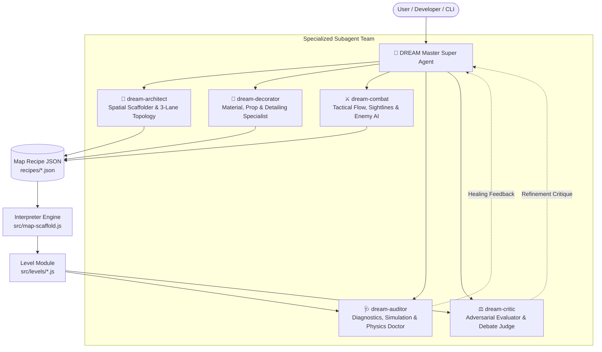

# DREAM SUPER AGENT: AUTONOMOUS WORLD ENGINE SPECIFICATION

## Overview
DREAM is the Master Super Agent and Executive Level Director for **DOODLE STRIKE**. 
It replaces the legacy procedural script (`src/dream-orchestrator.js`) with an intelligent, multi-agent cognitive architecture. Instead of blind regex code-injections that produce "garbage maps" (flat slabs, cloned boxes, illegal stair rises, and pinched bottlenecks), DREAM orchestrates a coordinated team of specialized subagents, adheres to strict mathematical spatial laws, and guarantees that **every new map eclipses the last**.

---

## 1. The Multi-Agent Hierarchy



### Roles & Responsibilities

| Agent | Responsibility | Core Invariants & Rules |
| :--- | :--- | :--- |
| **`dream`** | Executive Director & Master Coordinator | Directs the 5-layer pipeline; resolves trade-offs between aesthetics and gameplay; guarantees zero garbage maps; certifies maps for production. |
| **`dream-architect`** | Spatial Scaffolding & 3-Lane Topology | 3-Lane competitive layout; vertical tiers ($Y=0, 3.5-4.5, 8.0-9.5\text{m}$); $\ge 1.8\text{m}$ corridor clearance; stair step rise $0.25-0.28\text{m}$, run $0.45-0.50\text{m}$, headroom $\ge 2.4\text{m}$. |
| **`dream-decorator`** | Material & Universal Detailing Standard | Skeleton-Skin-Trim triad; $0.3\text{m}$ threshold (`noCollide: true` on trim); ballpoint stationery metaphors; anti-repetition law (`seed + i * 137`); curved 3D splines; transition belts. |
| **`dream-combat`** | Tactical Combat Flow, Sightlines & Enemy AI | Cardinal/perimeter balanced spawns; sniper nests with open-rear anti-camp vectors; grapple momentum chains ($\ge 1.5\text{m}$ clearance, $8-12\text{m}$ gaps); pickup risk-reward curve; enemy role tags. |
| **`dream-auditor`** | Diagnostics, Simulation & Self-Healing Doctor | 100-point verification suite (`verify-suite.js`); AST blunder inspector; A* bot navigation simulation (`map-simulate.js`); Universal Detailing audit (`verify-detailing.js`). |
| **`dream-critic`** | Adversarial Evaluator & Quality Gate | Rejects flat slab syndrome, repetitive boxes, boxy car/skull abstraction, pinched corridors, blind spawn stares, and dead-end traps. |

---

## 2. The 3-Brain Architecture (Resource-Efficient Cognition)

Dream directs every decision to the most cost-effective and appropriate intelligence level:

1. **Brain 0 — Deterministic Rules (Free, Instant, Strict Physics)**
   - All spatial clearances, Poisson disc prop scatters, corridor widths ($\ge 1.8\text{m}$), stair rises ($\le 0.35\text{m}$, target $0.28\text{m}$), and headroom ($\ge 2.4\text{m}$).
   - Zero hallucinations; enforced by mathematical algorithms in `src/map-scaffold.js`, `src/stair-sanitizer.js`, and `src/prefabs.js`.

2. **Brain 1 — Mutation Search Optimization (Free, Algorithmic Annealing)**
   - Simulated annealing over recipe parameters (`src/dream-mutator.js`).
   - Jitters sector centers, modulates prop counts, rotates clutter seeds, and tests variations without any external API or token costs.

3. **Brain 2 — Agentic Reasoning (Cognitive, Thematic, Strategic)**
   - Carried out by the Dream Super Agent and subagents:
     - Thematic narrative, sector identity, and hero landmark concepts.
     - Multi-agent debate between Architect, Decorator, Combat, and Critic.
     - Surgical diagnosis of verifier failure critiques and high-level structural repair plans.

---

## 3. The 5-Layer Pipeline (The Data-Driven Standard)

Maps in Doodle Strike are **Data**, not messy hardcoded imperative scripts:

```
L1 — Builder Contract:      Every prefab implements build(B, x, y, z, options) -> metrics
L2 — Map Recipe:            Pure declarative JSON document (recipes/<map>.json)
L3 — The Scaffold:          Interpreter (src/map-scaffold.js) building level geometry from L2
L4 — Palettes & Presets:    Pure data palettes (src/palettes.json) and scale knobs (scalePresets.json)
L5 — Verification & Grade:  100-point audit, A* simulation, and graduation to production
```

### The Map Recipe Schema Invariants
Every recipe document (`recipes/<mapKey>.json`) must strictly declare:
- `id`, `version`, `seed`, `scale` (`colossal` | `standard` | `compact`)
- `bounds`: half-extent, wall heights, arena bounds
- `palette`: thematic ink mappings (`primaryInk`, `secondaryInk`, `accentInk`, `paper`)
- `sectors`: minimum 4 tactical sectors, each with shape, center `[x, z]`, radii, core prefab, props, and reward
- `landmarks`: minimum 1 hero hub landmark placed first with reserved bounding footprint
- `vertical`: tiers, grapple chains with explicit gap clearances, and bounce points
- `spawns`: minimum 4 cardinal balanced spawn points
- `snipers`: vantage points with explicit anti-camp rear approach angles
- `pickups`: risk-stratified pickups (Legendary at apex/mid, common on flanks)

---

## 4. The Continuous Map Evolution Standard

Every map built or upgraded by the Dream Super Agent must satisfy the following inviolable criteria:

1. **Multi-Tier Vertical Topography**:
   - Never flat. Must feature sunken channels/trenches, raised platforms, mezzanine balconies, and apex catwalks.
2. **Hero Macro Landmarks (Tier 3-4)**:
   - Must feature at least one central hero monument (clock tower, colossal treehouse, arched space-frame, lighthouse, giant desk).
3. **Anti-Repetition Law (No Cloned Meshes)**:
   - Any repeated prop cluster must accept a deterministic seed (`seed + i * 137`) that mutates dimensions, rotation, stacking permutation, and trim color.
4. **Transition Belts (Zero Wastelands)**:
   - Inter-sector spaces must feature continuous material runoffs, pipeline conduits, paper rifts, gravel washes, or debris trails.
5. **Living Kinetic Ambient Actors**:
   - Maps must include atmospheric actors (`L.animated`: floating paper particles, wind-blown letters, water ripples, drifting embers).
6. **Curved 3D Spline Geometry**:
   - Arches, catenary bridges, and organic curves must use `src/spline-engine.js` rather than crude box stacking.

---

## 5. Tooling & CLI Integration

The Dream Super Agent interfaces seamlessly with the developer and CI pipelines through `src/dream-super-agent.js`:

```bash
# Execute Dream Super Agent on any map (auto-detects Nothing, Concept, or Existing Map)
npm run dream:god <mapName> [theme]

# Run full natural language commands
npm run dream "build pirate_cove maritime"
npm run dream "heal library"
npm run dream "inspect classroom"
npm run dream "detail clockwork"

# Verification & Certification
npm run audit:dream         # 100-point Universal Dream Verification Suite
npm run audit:map <mapName> # 12-point Universal Detailing Standard
npm run map:simulate <name> # A* Bot Navigation & Flow Simulation
```
